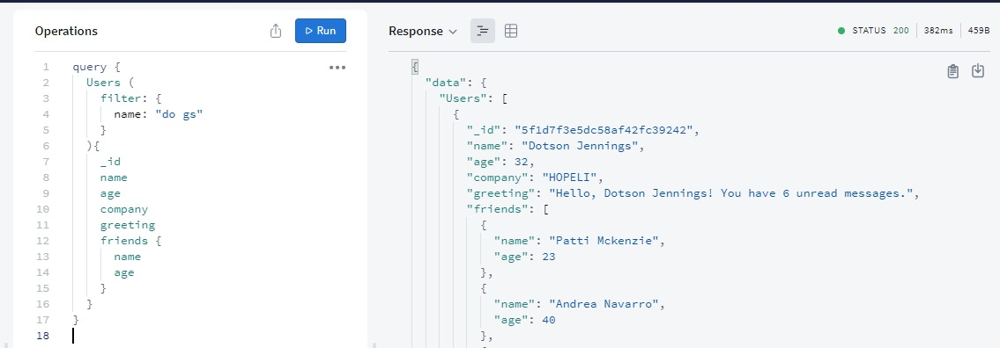

# MySocial

Sample webapp showcasing a Node.js backend and a React frontend. Based on [this challenge](https://github.com/criticalmassbr/dialog-pwa-test).

## Backend


### Stack
- NodeJS
- Express
- GraphQL (Apollo Server)
- TypeScript

### Running
```bash
gh repo clone rafasilveira/mysocial
cd mysocial
cd backend
yarn install
yarn start
```

## Frontend
Coming soon :)
